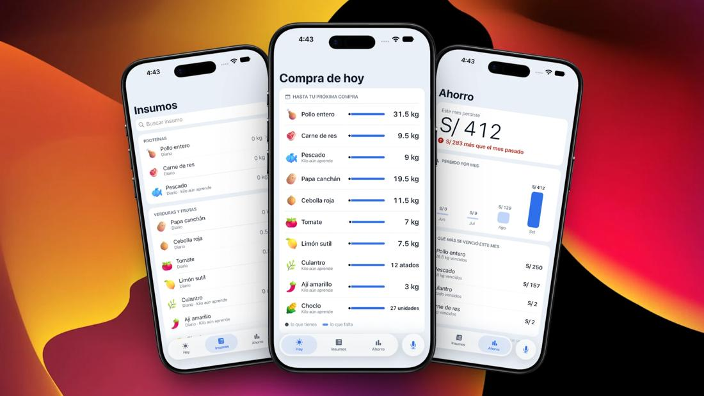

  

## About Me

<table>
<tr>
<td width="65%">

Full Stack Developer with hands-on experience building software for clients across different industries — I enjoy learning what each project demands and prioritizing maintainable architecture, guided by clean software engineering practices, over quick fixes.

Outside of code, you'll find me at the gym or gaming with friends — balance keeps the ideas fresh.

Want to see more of my work? Check out my portfolio → [danton-rm.vercel.app](https://danton-rm.vercel.app)

</td>
<td width="35%" align="center">

</td>
</tr>
</table>

## Featured Projects

<table>
<tr>
<td width="50%" valign="top">

<h3 align="center"><a href="https://github.com/JosepRivera/overload-server">🏋️ Overload</a></h3>

Strength-training platform that turns every logged set into data — volume moved, personal records, and estimated 1RM.

</td>
<td width="50%" valign="top">

<h3 align="center"><a href="https://kilo-docs-mu.vercel.app/producto/vision-general/">🥬 Kilo</a></h3>

Mobile app that helps small restaurants in Lima stop buying supplies "by eye" — voice logging, Holt-Winters demand forecasting, purchase recommendations, expiry alerts, and savings tracking.

</td>
</tr>
</table>

## Stats & Languages

  
  

## GitHub Activity

  

  

